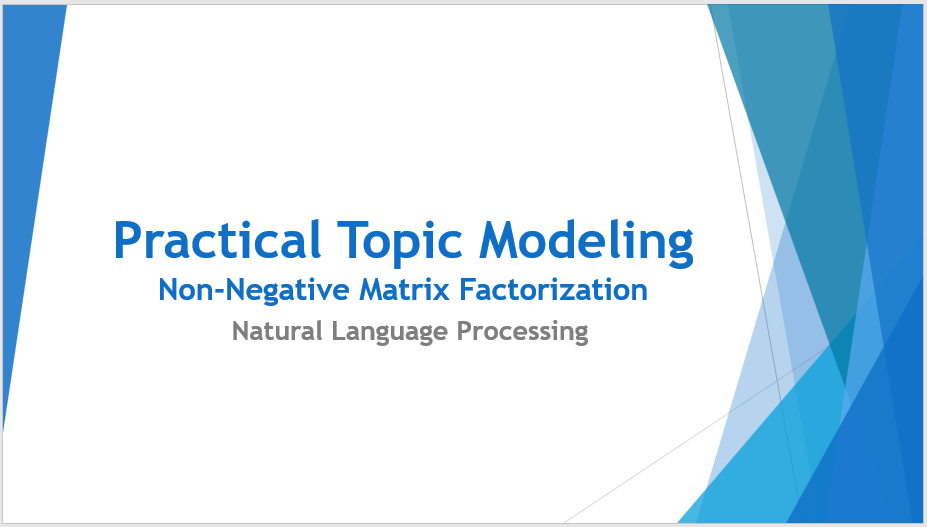

# Topic-Modeling-with-Non-Negative-Matrix-Factorization-NMF-

**CASE:**
Consumers provide feedback on financial products or services and our task is to extract the hidden themes/topics and assign each of the feedback documents to one of these themes or topics.

**Solution:**
Train a Natural Language Processing machine learning model to extract the topics from each of the open-ended complaint text document.

**Data Source:**
The data is downloaded from kaggle via this url: [consumer complaint data](https://www.kaggle.com/cfpb/us-consumer-finance-complaints)

Topic Modeling is an unsupervized machine learning technique to discover the hidden/latent thematic structure in a large corpus of text documents.
[Latent Dirichlet Analysis](http://jmlr.org/papers/volume3/blei03a/blei03a.pdf) (LDA) and [Non-Negative Matrix Fatactorization](https://papers.nips.cc/paper/1861-algorithms-for-non-negative-matrix-factorization.pdf) (NMF) are the two most popular topic modeling techniques. LDA uses a probabilistic approach where as NMF uses matrix factorization approach.
